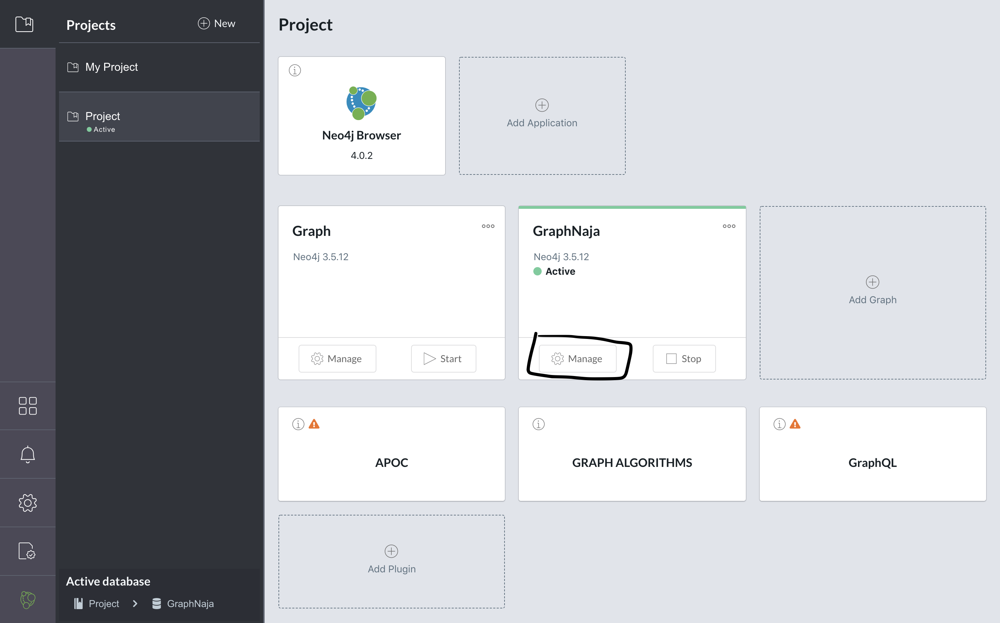
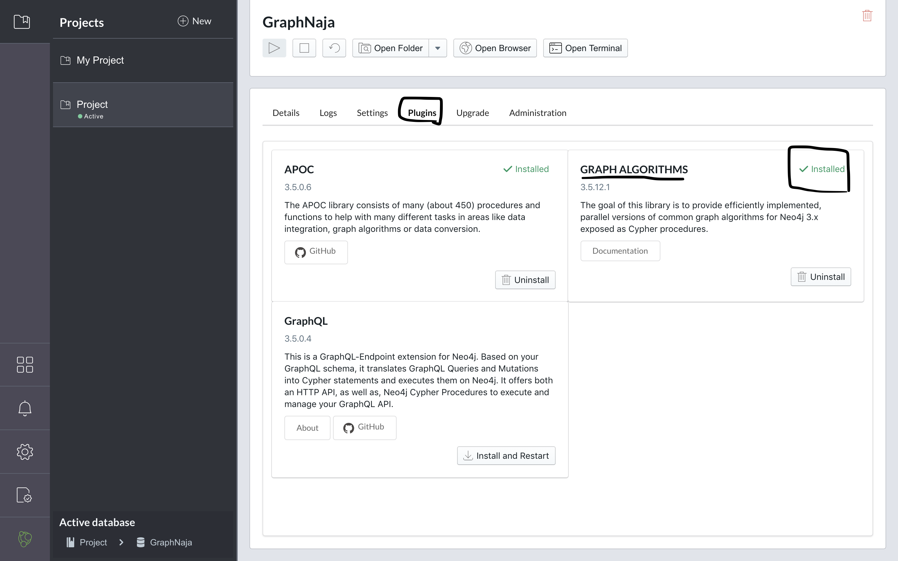
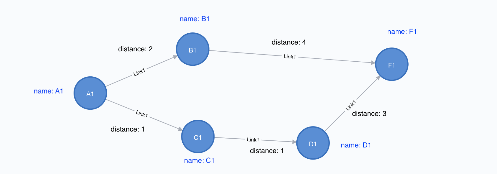

# Cypher

ตัวอย่าง Cypher เบื้องต้น

> หมายเหตุ  
> 1. ใน code บางคำตัวพิมพ์เล็ก ตัวพิมพ์ใหญ่ใช้แทนกันได้ (case insensitive)  
> 2. ใน code บางคำเป็นแค่ชื่อตัวแปร ซึ่งเวลาใช้ต้องเปลี่ยนตามโจทย์ที่ให้มา  
> 3. ต้องติดตั้ง plugin `GRAPH ALGORITHMS` โดยสามารถเซ็คได้ดังนี้

> 

> 


## Start (initial graph)

เริ่มจากการสร้าง graph ซึ่งเราจะใช้ graph ต่อไปนี้กับทุกตัวอย่าง

```
MERGE (a1: Node1 { name: "A1" })
MERGE (b1: Node1 { name: "B1" })
MERGE (c1: Node1 { name: "C1" })
MERGE (d1: Node1 { name: "D1" })
MERGE (f1: Node1 { name: "F1" })

MERGE (a1)-[:Link1 { distance: 2 }]->(b1)
MERGE (a1)-[:Link1 { distance: 1 }]->(c1)
MERGE (b1)-[:Link1 { distance: 4 }]->(f1)
MERGE (c1)-[:Link1 { distance: 1 }]->(d1)
MERGE (d1)-[:Link1 { distance: 3 }]->(f1);
```




## Shortes path

https://neo4j.com/docs/graph-algorithms/current/labs-algorithms/shortest-path/

แบบสนใจ weight

```
// หา Shortes path from A1->F1
MATCH (start:Node1{name:"A1"}), (end:Node1{name:"F1"})

// ระบุ weight property ในที่นี้คือ distance
CALL algo.shortestPath.stream(start, end, "distance")

YIELD nodeId, cost

MATCH (other:Node1) WHERE id(other) = nodeId

RETURN other.name AS name, cost;
```

แบบไม่สนใจ weight (ทุก relation มี weight เป็น 1)

```
// หา Shortes path from A1->F1
MATCH (start:Node1{name:"A1"}), (end:Node1{name:"F1"})

// ไม่ต้องระบุ weight property
CALL algo.shortestPath.stream(start, end)

YIELD nodeId, cost

MATCH (other:Node1) WHERE id(other) = nodeId

RETURN other.name AS name, cost;
```

## MST

https://neo4j.com/docs/graph-algorithms/current/labs-algorithms/minimum-weight-spanning-tree/

ขั้นตอนที่ 1: สร้าง relation สำหรับ MST โดยใช้ชื่อว่า MINST และ return performance ของการทำงาน

```
MATCH (n:Node1 {name:"A1"})

CALL algo.spanningTree.minimum("Node1", "Link1", "distance", id(n), {write:true, writeProperty:"MINST"})

YIELD loadMillis, computeMillis, writeMillis, effectiveNodeCount

// return performance ของการทำงาน
RETURN loadMillis, computeMillis, writeMillis, effectiveNodeCount;
```

ขั้นตอนที่ 2: แสดง MST เป็นตารางจาก relation MINST ที่สร้างไว้ก่อนหน้านี้

```
MATCH path = (n:Node1 {name:"A1"})-[:MINST*]-()

WITH relationships(path) AS rels

UNWIND rels AS rel

WITH DISTINCT rel AS rel

RETURN startNode(rel).name AS source, endNode(rel).name AS destination, rel.distance AS cost;
```

## Degree centrality

https://neo4j.com/docs/graph-algorithms/current/labs-algorithms/degree-centrality/

```
CALL algo.degree.stream("Node1", "Link1", {direction: "incoming"})

YIELD nodeId, score

RETURN algo.asNode(nodeId).name AS node, score

ORDER BY score DESC;
```

สามารถเลือก direction ได้ 3 แบบ

- `'incoming'`: สนใจขาเข้า (เป็น `default` option)

- `'outgoing'`: สนใจขาออก

- `'both'`: ไม่สนทิศทาง (undirected graph)


## Betweeness centrality

https://neo4j.com/docs/graph-algorithms/current/labs-algorithms/betweenness-centrality/

```
CALL algo.betweenness.stream("Node1", "Link1", {direction:"OUT"})

YIELD nodeId, centrality

MATCH (n:Node1) WHERE id(n) = nodeId

RETURN n.name AS node, centrality

ORDER BY centrality DESC;
```

สามารถเลือก direction ได้ 3 แบบ

- `'INCOMING'`,`'IN'`,`'I'`,`'<'`: สนใจขาเข้า (เป็น incoming option)

- `'OUTGOING'`,`'OUT'`,`'O'`,`'>'`: สนใจขาออก (เป็น `default` option)

- `'both'`,`'<>'`: ไม่สนทิศทาง (undirected graph)


ดูเพิ่มเติมที่ https://neo4j.com/docs/graph-algorithms/current/labs-algorithms/betweenness-centrality/#labs-algorithms-betweenness-centrality-support

## Closeness centrality

https://neo4j.com/docs/graph-algorithms/current/labs-algorithms/closeness-centrality/

```
CALL algo.closeness.stream("Node1", "Link1")

YIELD nodeId, centrality

MATCH (n:Node1) WHERE id(n) = nodeId

RETURN n.name AS node, centrality

ORDER BY centrality DESC;
```

หรือใส่ Limit (query อันอื่นก็สามารถใส่ Limit ได้)

```
CALL algo.closeness.stream("Node1", "Link1")

YIELD nodeId, centrality

MATCH (n:Node1) WHERE id(n) = nodeId

RETURN n.name AS node, centrality

ORDER BY centrality DESC

// แสดงข้อมูลแค่ 3 row
LIMIT 3;
```

## Pagerank centrality

https://neo4j.com/docs/graph-algorithms/current/algorithms/page-rank/


```
// iterations คือจำนวนรอบการ run (default คือ 20 รอบ)
CALL algo.pageRank.stream("Node1", "Link1", {iterations:100})

YIELD nodeId, score

RETURN algo.asNode(nodeId).name AS page,score

ORDER BY score DESC;
```

สามารถบอก weight ได้ (ถ้ามี) เช่น

```
// บอก weightProperty เป็นชื่อ property ที่เก็บ wieght ในที่นีั้คือ distance
CALL algo.pageRank.stream("Node1", "Link1", {iterations:100, weightProperty: "distance"})

YIELD nodeId, score

RETURN algo.asNode(nodeId).name AS page, score

ORDER BY score DESC;
```

และสามารถเลือก direction ได้ 3 แบบ

- `'INCOMING'`: สนใจขาเข้า

- `'OUTGOING'`: สนใจขาออก (เป็น `default` option)

- `'BOTH'`: ไม่สนทิศทาง (undirected graph)

ดูเพิ่มเติมที่ https://neo4j.com/docs/graph-algorithms/current/algorithms/page-rank/#algorithms-pagerank-support
